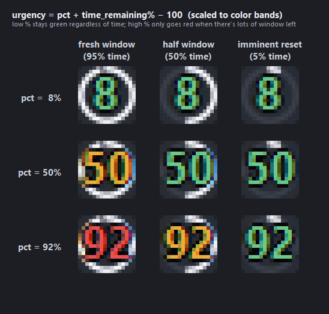

# claude-tray

Always-on Claude Code usage dashboard for Windows.

Two side-by-side tray icons show your 5-hour session and 7-day weekly utilization. The percentage color isn't just the raw value — it's **normalized by how much of the reset window is still left** so the icon only goes red when you're actually in trouble (high % *and* lots of window remaining), not when you're at 95 % with two minutes to reset. A transparent always-on-top widget mirrors the same visual language at a larger size.


## The urgency color model

Raw % is half the story. Being at 90 % with 4 hours left of a 5-hour window is a problem — you'll burn out before reset. Being at 90 % with 2 minutes left isn't — you'll reset to 0 in 2 minutes. Plain severity-by-% can't tell those apart, so the color is driven by a single formula:

```
urgency = pct + time_remaining% − 100   (= pct − elapsed%)
```

| urgency | meaning | color |
|---|---|---|
| **< 30** | on pace or ahead — you'll finish under quota | green |
| **30 – 60** | burning faster than the reset can save you | amber |
| **≥ 60** | catastrophic burn rate — will exhaust before reset | red |

Both the tray icons and the widget rings use this function. The 3×3 map across `(pct × time_remaining)`:



**Low % stays green regardless of time.** **High % only goes red when there's lots of window left.** The bottom-right cell (92 % at 5 % time remaining) is green because the reset is right there — you made it.

## Visual language

The same two visual elements appear in both surfaces:

- **White ring / arc** drains as the reset window elapses — full circle just after a reset, gone right before the next one.
- **Big bold percentage number** colored by urgency — green / amber / red.

The widget adds the obvious extras the tray slot can't fit: section labels ("5h session" / "7d weekly") and reset countdowns ("resets 2h 18m").

## Features

- **Two tray icons** rendered natively at 16×16 — bold percentage colored by urgency, white perimeter arc that drains with time.
- **Transparent always-on-top widget** mirrors the tray rings at a readable size, adds labels and reset countdowns. Drag to move, scroll-wheel to resize, right-click for refresh / opacity / quit.
- **Polls every 60 s** with a free OAuth endpoint + Haiku-header-probe fallback — total quota cost is ~0.05 % of your 5 h window even in the worst case.
- **Persists position, size, opacity, visibility** across restarts (`~/.claude/.usagedashboard.json`).
- **Tray click toggles** the floating widget. Right-click for menu.
- **Multi-monitor aware** — places itself on whichever screen your cursor is on; recovers gracefully if a previously-saved position is on a disconnected monitor.

## Install

Requires Python 3.10+ and a Claude Pro/Max subscription you've already signed into via [Claude Code](https://docs.claude.com/en/docs/claude-code).

```powershell
git clone https://github.com/snipemanmike/claude-tray
cd claude-tray
pip install -r requirements.txt
pythonw usagedashboard.py
```

Two tray icons appear (initially under the `^` overflow chevron — see below). The widget appears on whichever monitor your cursor is on.

### Auto-start on login

Drop a shortcut to `run.bat` (or `pythonw.exe usagedashboard.py`) into your Startup folder:

```
Win+R → shell:startup → drop shortcut
```

### Pin the tray icons to the always-visible strip

Windows places new tray icons under the overflow chevron `^` by default. Pin them out once:

- **Easy:** click the `^`, drag each icon left past the chevron into the always-visible strip.
- **Settings way:** *Settings → Personalization → Taskbar → Other system tray icons* → toggle both **Claude Usage Dashboard** entries on.

## Controls

| Surface | Action | What it does |
|---|---|---|
| Tray icon | Left-click | Show / hide the floating widget |
| Tray icon | Right-click | Show / hide widget • Refresh now • Quit |
| Tray icon | Hover | Tooltip with exact % and reset countdown |
| Widget | Left-click + drag | Move (position persisted) |
| Widget | Scroll wheel | Resize (0.6× – 2.0×) |
| Widget | Right-click | Refresh now • Opacity 50 / 75 / 92 / 100 % • Quit |

## States at a glance

| | Chill | Burning fast | Made it |
|---|---|---|---|
| Scenario | low % regardless of time | mid % with lots of window left | high % but reset is right there |
| Widget |  |  |  |

Tray icons across four scenarios spanning the urgency range (shown 8× upscaled):


## How it works

Reads the OAuth access token Claude Code keeps at `~/.claude/.credentials.json`. Two data sources, tried in order:

**1. Primary — `/api/oauth/usage`** (free, no quota cost)
A `GET` to `https://api.anthropic.com/api/oauth/usage` with the OAuth Bearer token and `anthropic-beta: oauth-2025-04-20`:

```json
{
  "five_hour":  {"utilization": 12.0, "resets_at": "2026-05-16T11:40:00Z"},
  "seven_day":  {"utilization":  7.0, "resets_at": "2026-05-20T21:00:00Z"},
  ...
}
```

`time_remaining_pct` is computed locally: `(resets_at − now) / window_length × 100`, with `window_length` of 5 h for the session limit and 7 d for the weekly limit.

**2. Fallback — `max_tokens=1` Haiku ping** (~0.0002 % of 5 h quota per call)
On a 429 from the primary, sends a minimum-cost message to `claude-haiku-4-5` and reads the response headers — `anthropic-ratelimit-unified-5h-utilization` and `-7d-utilization` give the same numbers. The widget remembers when OAuth was throttled and skips it during the backoff window so we don't waste round-trips.

> **Why two paths?** `/api/oauth/usage` is undocumented and currently has an aggressive rate limit (see [anthropics/claude-code#31637](https://github.com/anthropics/claude-code/issues/31637) — polls as slow as 5 min can trip 429, and recovery can take 30+ min with no `Retry-After`). The header probe is bullet-proof but costs a tiny fraction of quota per call. The hybrid gets you free polling when the endpoint works and reliable polling when it doesn't. At 60 s polling, even worst-case "header probe every time" burns about **0.05 % of your 5 h quota over the full 5 h window** — basically noise.

The OAuth access token expires every ~8–10 hours. On `401`/`403` the widget refreshes the token itself via `POST https://claude.ai/v1/oauth/token` using the on-disk `refreshToken` (same client_id Claude Code uses) and writes the rotated credentials back to `~/.claude/.credentials.json`, so Claude Code stays in sync too. No need to launch the CLI just to re-auth on cold boot.

## The 16×16 tray-icon ceiling

Windows tray icons are limited to `SM_CXSMICON` (16×16 px at 100 % DPI, larger at higher DPI). The clock and Ink Workspace aren't tray icons — they're special shell widgets. We render natively at 16×16 (no downsample blur) and use two side-by-side slots — one for 5h, one for 7d — so each gets the full pixel budget. The pair is positionally identifiable (left = 5h, right = 7d); the tooltip names them on hover.

## Configuration

There's no config file — sensible defaults. To change behavior, edit constants at the top of `usagedashboard.py`:

```python
POLL_SECONDS        = 60        # how often to refetch usage
MAX_BACKOFF_SECONDS = 1800      # 30 min ceiling on OAuth-endpoint 429 backoff
USAGE_URL           = "https://api.anthropic.com/api/oauth/usage"
HEADER_PROBE_MODEL  = "claude-haiku-4-5-20251001"
```

State (window position, size, opacity, visibility) lives in `~/.claude/.usagedashboard.json`. Delete it to reset.

## Regenerating the doc images

```powershell
python docs/render.py
```

Produces `hero.png`, `tray.png`, `widget-low/mid/high.png`, and `urgency.png` from synthetic data — no live desktop screenshots are ever captured, so the repo never leaks personal taskbar / wallpaper content.

## Uninstall

```powershell
# stop running instance
Get-Process pythonw | Stop-Process -Force

# remove autostart (if you created the shortcut)
Remove-Item "$env:APPDATA\Microsoft\Windows\Start Menu\Programs\Startup\Claude Usage Dashboard.lnk"

# remove saved state
Remove-Item "$env:USERPROFILE\.claude\.usagedashboard.json"

# remove the repo
Remove-Item -Recurse -Force claude-tray
```

## Acknowledgments

The undocumented `/api/oauth/usage` endpoint and its response shape was documented by [ohugonnot/claude-code-statusline](https://github.com/ohugonnot/claude-code-statusline). Several similar tools served as design references: [bozdemir/claude-usage-widget](https://github.com/bozdemir/claude-usage-widget), [CodeZeno/Claude-Code-Usage-Monitor](https://github.com/CodeZeno/Claude-Code-Usage-Monitor), [SlavomirDurej/claude-usage-widget](https://github.com/SlavomirDurej/claude-usage-widget).
