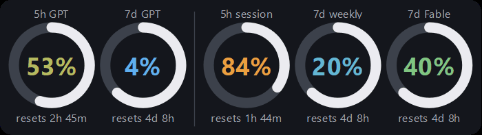
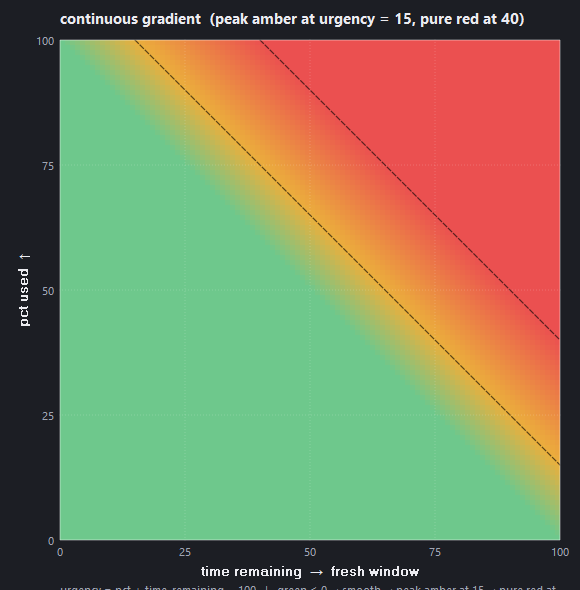

# claude-tray

**Every AI usage limit you pay for, always on screen.**

Four live meters embedded in the Windows taskbar — ChatGPT's weekly limit on a teal tile, Claude's 5-hour session, 7-day weekly, and 7-day Fable limits on slate — each one a ring that drains with time and a percentage colored by whether you're *actually* going to run out.


A day of usage, timelapsed — session windows fill and reset, weekly meters creep, colors follow urgency, the white ring is time left in the window:



## Reading the tiles

| tile | meter | source |
|---|---|---|
| `gw` | ChatGPT weekly limit | Codex usage endpoint (live, free) |
| `h` | Claude 5-hour session | Anthropic OAuth usage endpoint |
| `d` | Claude 7-day weekly (all models) | Anthropic OAuth usage endpoint |
| `fd` | Claude 7-day Fable | OAuth endpoint `limits[]` array |

Teal base = OpenAI, slate base = Claude, wider gap between the groups. Click any tile to toggle the floating widget; right-click for refresh/quit. Drag the widget anywhere, scroll to resize.

## The color model

Color isn't raw %. It's normalized by how much of the reset window is left:

```
urgency = pct + time_remaining% − 100
```

| color | urgency | meaning |
|---|---|---|
| **blue**  | ≤ −25 | under-utilizing — slack on the table |
| **green** | 0     | on pace — maximizing compute-to-cost |
| **amber** | 15    | burning faster than reset can save you |
| **red**   | ≥ 40  | will exhaust before the window resets |

Continuous gradient between anchors. Live curve over the full `(time_remaining, pct)` plane:



92% used with two hours left is an emergency; 92% used two minutes before reset is a victory lap. If you want to maximize what you paid for, aim for green.

## How it works

**Claude** — reads the OAuth token from `~/.claude/.credentials.json` (where Claude Code stores it) and polls `https://api.anthropic.com/api/oauth/usage` every 60 s (free, no quota cost). On 429 — the endpoint rate-limits aggressively ([anthropics/claude-code#31637](https://github.com/anthropics/claude-code/issues/31637)) — it falls back to a `max_tokens=1` Haiku ping and reads the rate-limit headers (~0.0002 % of 5 h quota per call). Auto-refreshes its own OAuth token when expired, so cold boot works without launching Claude Code first.

**Fable** — the per-model weekly cap only exists in the OAuth endpoint's `limits[]` array (the header-probe fallback can't see it), so the last reading is cached in the state file and survives throttle windows and restarts.

**ChatGPT** — polls `GET https://chatgpt.com/backend-api/codex/usage` with the ChatGPT token from `~/.codex/auth.json` (kept fresh by the Codex CLI). It returns the plan's weekly usage as plain JSON with **no completion generated — zero token cost**, so it's live every cycle regardless of whether Codex is running. (ChatGPT plans now expose only a weekly cap; the old 5-hour limit is gone.) Falls back to tailing the local Codex session logs when offline, and caches the last reading so it survives restarts.

**Taskbar embed** — the overlay is a `WS_CHILD` window `SetParent`'d into `Shell_TrayWnd`, so the shell can't paint over it. It survives explorer restarts, lock/unlock, and sleep via session-change notifications, and slides left of any small topmost pill (dictation bubbles, recorders) that docks over its spot near the tray.

**Single instance** — launching the script terminates any older instance of itself first (newest launch wins), so re-running `run.bat` always means "restart with current code" — no stacked ghosts fighting over the taskbar and state file.

## Install

```powershell
git clone https://github.com/snipemanmike/claude-tray
cd claude-tray
pip install -r requirements.txt
pythonw usagedashboard.py
```

Auto-start: `Win+R` → `shell:startup` → drop a shortcut to `run.bat`.

Regenerate the README art: `python docs/render.py`.

## Acknowledgments

Endpoint shape documented by [ohugonnot/claude-code-statusline](https://github.com/ohugonnot/claude-code-statusline). Taskbar-embed technique borrowed from [CodeZeno/Claude-Code-Usage-Monitor](https://github.com/CodeZeno/Claude-Code-Usage-Monitor).
