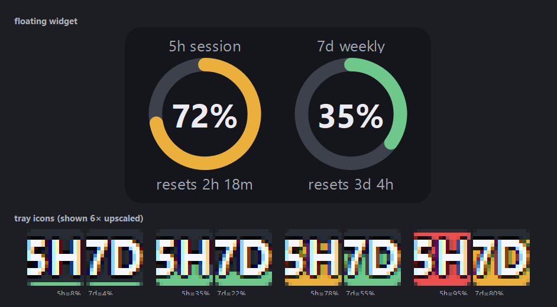
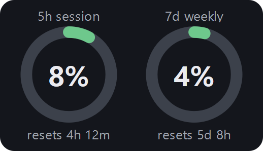
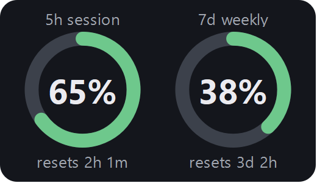
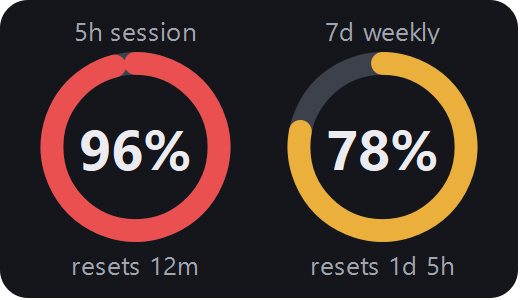
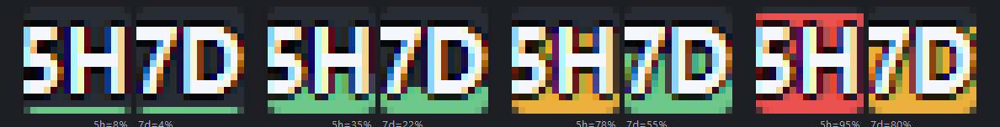

# claude-tray

Always-on Claude Code usage dashboard for Windows.

Two side-by-side tray icons show your 5-hour session and 7-day weekly utilization with bottom-up fill bars (green → amber → red). A transparent always-on-top widget with ring gauges and reset countdowns sits on the desktop.



## Features

- **Two tray icons** (`5H`, `7D`) rendered natively at 16×16 with a vertical fill bar that grows with utilization. Color shifts from green to amber (≥70%) to red (≥90%).
- **Transparent always-on-top widget** with two ring gauges, percentages, and reset countdowns. Drag to move, scroll-wheel to resize, right-click for opacity / quit.
- **Polls every 60 s** from the Claude Code OAuth usage endpoint — no extra API key, no token cost.
- **Persists position, size, opacity, visibility** across restarts (`~/.claude/.usagedashboard.json`).
- **Tray click toggles** the floating widget. Tray right-click for refresh / quit.
- **Multi-monitor aware** — places itself on whichever screen your cursor is on; recovers gracefully if you save a position on a monitor you later disconnect.

## Install

Requires Python 3.10+ and a Claude Pro/Max subscription that you've already signed into via [Claude Code](https://docs.claude.com/en/docs/claude-code).

```powershell
git clone https://github.com/snipemanmike/claude-tray
cd claude-tray
pip install -r requirements.txt
pythonw usagedashboard.py
```

Two tray icons appear (initially under the `^` overflow chevron — see below). The floating widget appears on whichever monitor your cursor is on.

### Auto-start on login

Drop a shortcut to `run.bat` (or `pythonw.exe usagedashboard.py`) into your Startup folder:

```
Win+R → shell:startup → drop shortcut
```

### Pin the tray icons to the always-visible strip

Windows places new tray icons under the overflow chevron `^` by default. Pin them out once:

- **Easy:** click the `^`, drag each icon left past the chevron into the always-visible strip.
- **Settings way:** *Settings → Personalization → Taskbar → Other system tray icons* → toggle **Claude Usage Dashboard** entries on.

## Controls

| Surface | Action | What it does |
|---|---|---|
| Tray icon | Left-click | Show / hide the floating widget |
| Tray icon | Right-click | Refresh now / show-hide / quit |
| Tray icon | Hover | Tooltip with exact % and reset countdown |
| Widget | Left-click + drag | Move (position is persisted) |
| Widget | Scroll wheel | Resize (0.6× – 2.0×) |
| Widget | Right-click | Opacity 50 / 75 / 92 / 100% / quit |

## States at a glance

| | Low | Mid | High |
|---|---|---|---|
| Widget |  |  |  |

Tray icons across four utilization scenarios (shown 8× upscaled):



## How it works

Reads the OAuth access token Claude Code keeps at `~/.claude/.credentials.json`, then `GET`s `https://api.anthropic.com/api/oauth/usage` with that Bearer token and the `anthropic-beta: oauth-2025-04-20` header. The response shape:

```json
{
  "five_hour":  {"utilization": 12.0, "resets_at": "2026-05-16T11:40:00Z"},
  "seven_day":  {"utilization":  7.0, "resets_at": "2026-05-20T21:00:00Z"},
  "seven_day_opus": null,
  "seven_day_sonnet": {"utilization": 0.0, "resets_at": null},
  "extra_usage": {...}
}
```

The same percentages you see on [claude.ai/settings/usage](https://claude.ai/settings/usage). Polled once per minute.

> **Heads up:** `/api/oauth/usage` is an undocumented internal endpoint. It's been stable since Claude Code shipped subscription auth, but Anthropic could change or remove it without notice. If polling starts failing, the widget shows "fetch failed" — open an issue.

The OAuth token expires periodically; Claude Code itself refreshes the token in `~/.claude/.credentials.json` whenever you use the CLI/IDE. As long as you keep using Claude Code, the widget stays authenticated.

## The 16×16 tray-icon ceiling

Windows tray icons are limited to `SM_CXSMICON` (16×16 px at 100% DPI, larger at higher DPI). The clock and Ink Workspace aren't tray icons — they're special shell widgets. To make text both labels and the % visible we use two side-by-side tray slots (one for 5H, one for 7D) and encode the % visually with a bottom-up fill bar so the icon still conveys "how full" at a glance.

## Configuration

There's no config file — sensible defaults. To change behavior, edit constants at the top of `usagedashboard.py`:

```python
POLL_SECONDS = 60         # how often to refetch usage
USAGE_URL    = "https://api.anthropic.com/api/oauth/usage"
BG_COLOR     = QColor(20, 22, 28, 200)   # widget background
```

State (window position, size, opacity, visibility) is at `~/.claude/.usagedashboard.json`. Delete it to reset.

## Uninstall

```powershell
# stop running instance
Get-Process pythonw | Stop-Process -Force

# remove autostart (if you created the shortcut)
Remove-Item "$env:APPDATA\Microsoft\Windows\Start Menu\Programs\Startup\Claude Usage Dashboard.lnk"

# remove saved state
Remove-Item "$env:USERPROFILE\.claude\.usagedashboard.json"

# remove the repo
Remove-Item -Recurse -Force claude-tray
```

## Acknowledgments

The undocumented `/api/oauth/usage` endpoint and its response shape was documented by [ohugonnot/claude-code-statusline](https://github.com/ohugonnot/claude-code-statusline). Several similar tools served as design references: [bozdemir/claude-usage-widget](https://github.com/bozdemir/claude-usage-widget), [CodeZeno/Claude-Code-Usage-Monitor](https://github.com/CodeZeno/Claude-Code-Usage-Monitor), [SlavomirDurej/claude-usage-widget](https://github.com/SlavomirDurej/claude-usage-widget).
